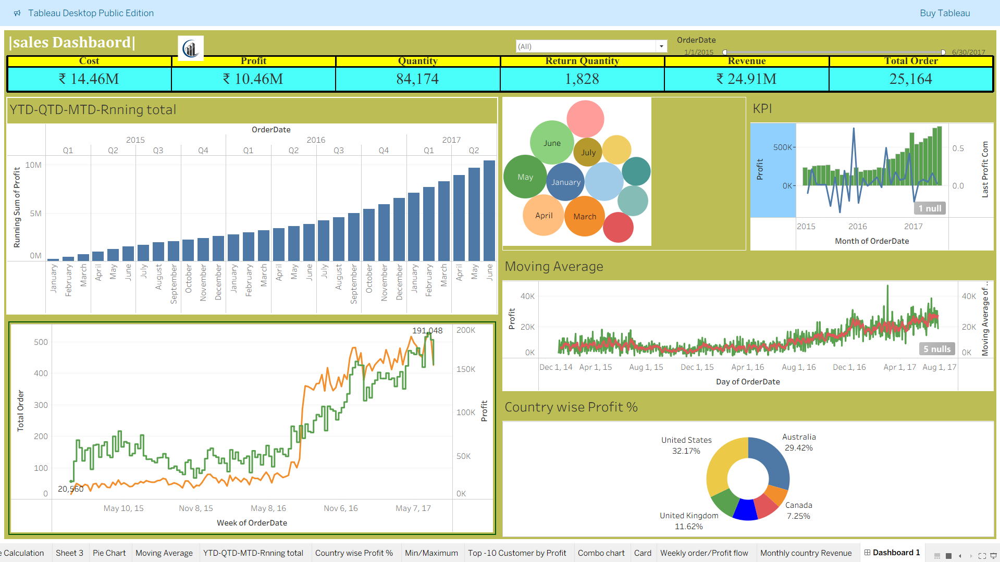

# 🌍 Global Sales Analysis 

##  Executive Overview
This project presents a **comprehensive global sales performance analysis**, developed using **Tableau** for visualization and **Excel** for data preparation.  
It highlights revenue distribution, profit margins, and regional growth patterns through interactive dashboards and calculated insights.

## Project Objective
To transform scattered global sales data into a **clear, interactive decision-making tool** that enables stakeholders to:
- Monitor sales and profitability across regions and categories  
- Identify top-performing markets and emerging opportunities  
- Detect trends in losses and underperforming zones for corrective actions  

##  Data Preparation & Integration
- Utilized **Microsoft Excel** for **data cleaning and transformation** — removed inconsistencies, standardized formats, and prepared structured tables.  
- Ensured **data accuracy and integrity** before importing into Tableau.  
- Created calculated columns and pre-aggregated metrics to improve Tableau performance and reduce loading time.  

##  Tableau Dashboard Design
- Developed a **multi-layered interactive dashboard** in Tableau focusing on:  
  -  **Regional Sales & Profit Distribution**  
  -  **Top and Bottom Performing Markets**  
  -  **Profit/Loss Analysis by Product Category**  
  -  **Sales Trends Over Time (Running Totals)**  
- Implemented **quick table calculations**, **dynamic filters**, and **parameter controls** for flexible exploration.  
- Designed a **clean, business-centric layout** emphasizing storytelling with color-coded KPIs and smooth navigation.

##  Analytical Highlights
-  **Global Coverage:** Visualized sales and profit metrics across multiple countries and regions.  
-  **Top Markets Identified:** Highlighted high-performing markets driving the majority of global sales.  
-  **Loss Detection:** Quickly isolated regions and products with negative margins.  
-  **Trend Tracking:** Applied running totals and YoY analysis to uncover seasonal fluctuations and long-term growth.  
   **Interactive Exploration:** Users can dynamically filter by region, category, or date range for deeper insight.  

##  Business Impact
This project demonstrates how **Tableau and Excel can seamlessly work together** to bridge data cleaning and visualization workflows.  
It delivers actionable intelligence for **executive decision-making**, allowing teams to:  
- Focus on profitable markets  
- Optimize product mix by region  
- Monitor growth and detect anomalies in real time  

##  Deliverables
- Cleaned and formatted Excel dataset  
- Tableau dashboard (.twbx)  
- Snapshot images for presentation use  
- Documentation outlining KPI definitions and calculated fields  

##  Key Skills Demonstrated
- Data Cleaning & Validation (Excel)  
- Data Blending and Relationships (Tableau)  
- Advanced Table Calculations & Filters  
- Dashboard Design & Data Storytelling  
- KPI Design and Visualization Best Practices

##  Dashboard Preview

##  Author
Created by **Bhaumik Sharma**  
[GitHub Profile](https://github.com/BhaumikSharma05)
